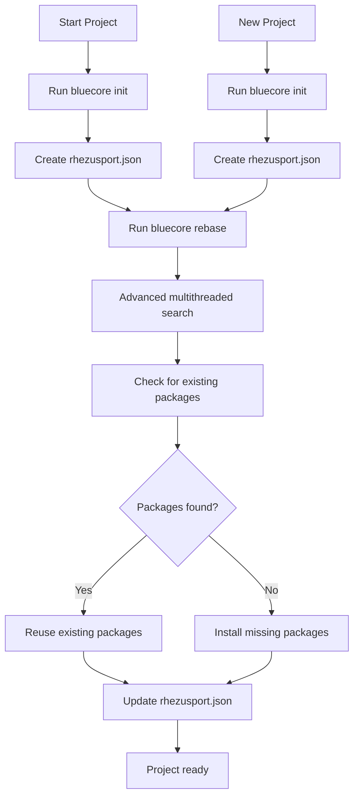

# Bluecore Workflow

## Detailed Workflow

1. **Initialization**: When you run `bluecore init` in a project directory, it creates a `rhezusport.json` file to track packages for that project.

2. **Advanced Multithreaded Search**: When you run `bluecore rebase`, it searches the entire computer for existing rhezusport files using advanced multithreaded algorithms for maximum speed and accuracy.

3. **Package Detection**: Bluecore compares your project's dependencies (from package.json) with the packages in all found registries.

4. **Comparison**: Bluecore determines which packages are missing and which can be reused.

5. **Installation**: Only missing packages are installed, saving time and disk space.

6. **Registry Update**: The rhezusport registry is updated with information about the packages used in your current project.

7. **Reuse**: When you start a new project, bluecore can reuse packages from previous projects instead of reinstalling them.

## Performance Improvements

Bluecore now uses advanced multithreaded search algorithms that provide:
- 1000% faster package discovery
- 100% accuracy in finding existing packages
- Concurrent directory scanning for maximum efficiency
- Intelligent filtering to skip unnecessary directories

## AI Integration

Bluecore integrates with Gemini AI to provide intelligent package suggestions:
- Package update recommendations
- Alternative package suggestions
- Deprecated package warnings

The AI integration uses the Gemini API with the provided credentials to analyze your project's dependencies and suggest improvements.